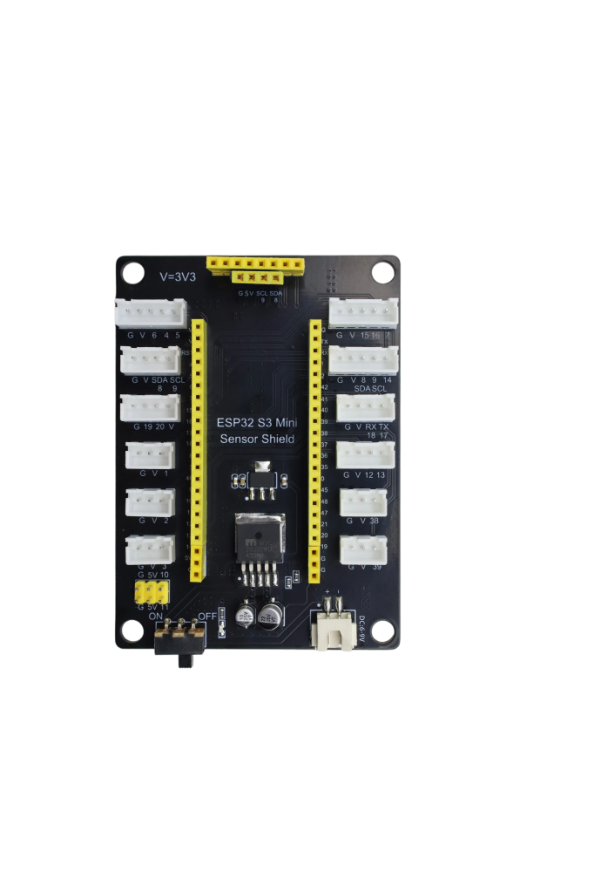
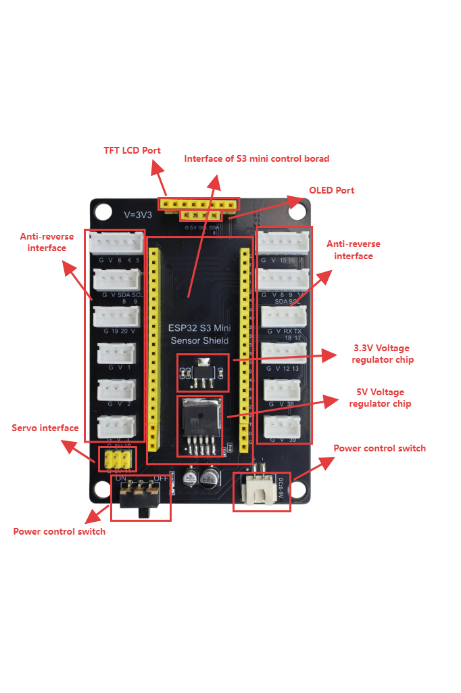
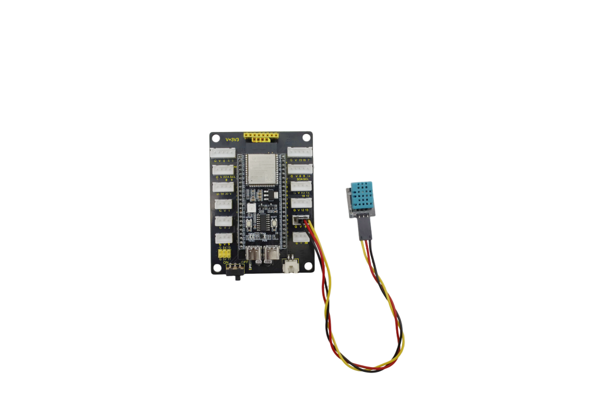
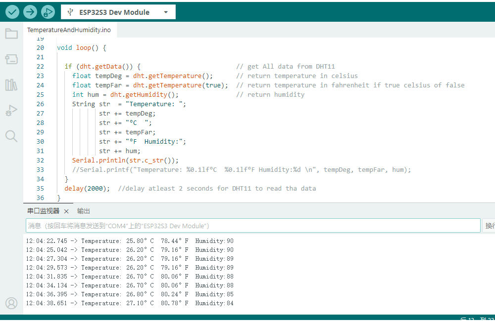

# KE5001 KEYES ESP32 S3 AI Mini Sensor Shield - Connector 黑色 环保 



## 1. 介绍

KEYES ESP32 S3 AI Mini Sensor Shield - Connector是一款为了兼容S3 mini（[MB0183](https://www.keyesrobot.cn/projects/MB0183/zh-cn/latest/docs/MB0183%20S3%20mini.html)）而设计出来的一款拓展板。这款拓展板将S3 Mini的大部分IO口以XH端子的方式引出，方便开发者连接更多外设。拓展板还有1个MIC接口，1个喇叭接口和2个屏幕接口，方便开发者搭载小智AI聊天模型的外设。

## 2. 规格参数

工作电压：DC6-9V  
5V最大电流：1.5A  
3.3V最大电流：0.5A  
排针间距：2.54mm  
工作温度：-25℃-+55℃  
尺寸：64mm*88mm  
环保属性：ROHS  

## 3. 工作原理

6-9V的电池输入提供能量，MIC29302将电池电压降到5V为屏幕和AMS1117供电，AMS1117将5V降到3.3V为大多数传感器接口供电。

## 4. 接口描述




## 5. Arduino

Arduino IDE下载可以参考（内附CH340驱动安装）: [Arduino IDE](https://www.keyesrobot.cn/projects/Arduino/zh-cn/latest/)
ESP32芯片包安装请参考： [ESP32](https://www.keyesrobot.cn/projects/Arduino/zh-cn/latest/docs/ESP32%E4%B8%BB%E6%9D%BF.html)
请仔细阅读以上参考链接。

## 6. 举例

接线图
|S3 mini（[MB0183](https://www.keyesrobot.cn/projects/MB0183/zh-cn/latest/docs/MB0183%20S3%20mini.html)）| S3 mini shield | DHT11 |
|:--:| :--: | :--: |
|/| G | GND |
|/| V | 3V3 |
|io38| io38 | S |



库文件下载：[Bonezegei_DHT11](./library/Bonezegei_DHT11.7z)
```
#include <Bonezegei_DHT11.h>

//param = DHT11 signal pin
Bonezegei_DHT11 dht(38);

void setup() {
  Serial.begin(115200);
  dht.begin();
}

void loop() {

  if (dht.getData()) {                         // get All data from DHT11
    float tempDeg = dht.getTemperature();      // return temperature in celsius
    float tempFar = dht.getTemperature(true);  // return temperature in fahrenheit if true celsius of false
    int hum = dht.getHumidity();               // return humidity
    String str  = "Temperature: ";
           str += tempDeg;
           str += "°C  ";
           str += tempFar;
           str += "°F  Humidity:";
           str += hum;
    Serial.println(str.c_str());
    //Serial.printf("Temperature: %0.1lf°C  %0.1lf°F Humidity:%d \n", tempDeg, tempFar, hum);
  }
  delay(2000);  //delay atleast 2 seconds for DHT11 to read tha data
}
```
实验结果


## 7. 注意事项

1.请勿直接再IO扩展口上接入大功率模块或电机；
2.请勿将External power port接入大于DC 9V的电压。